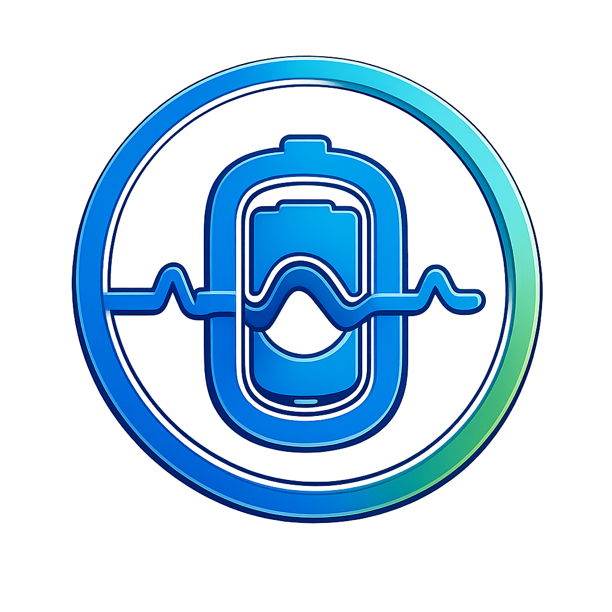
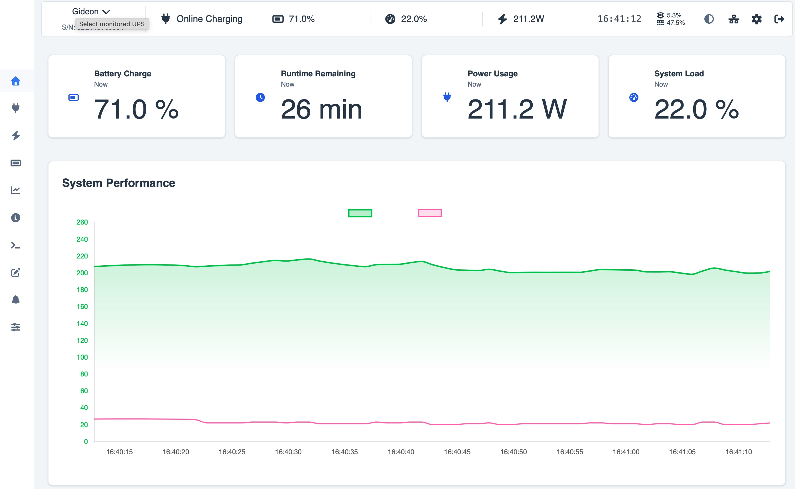
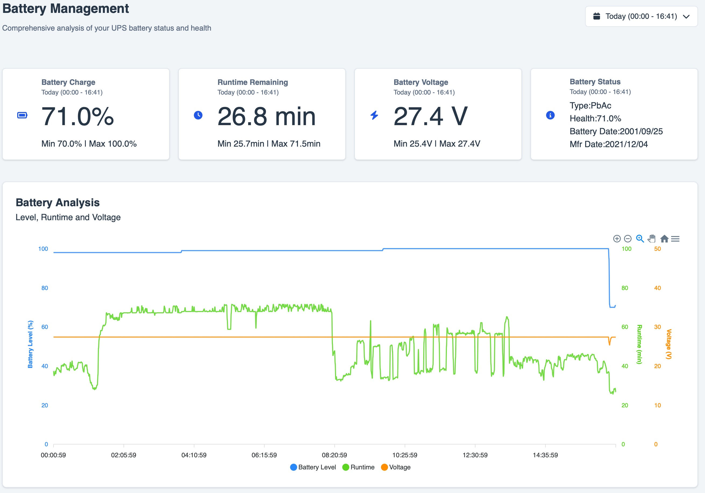
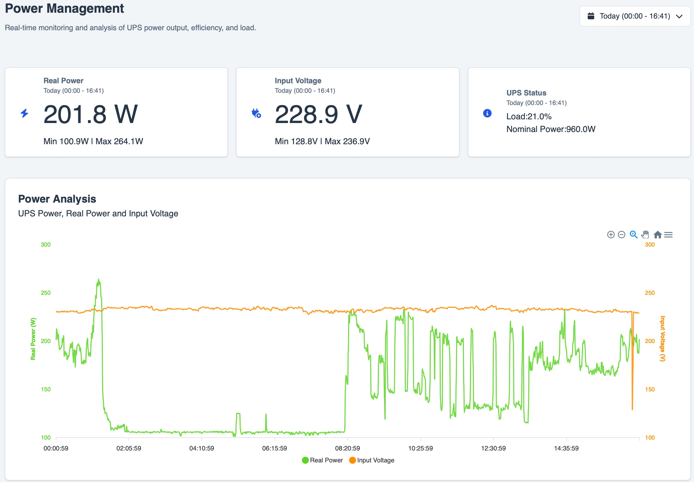
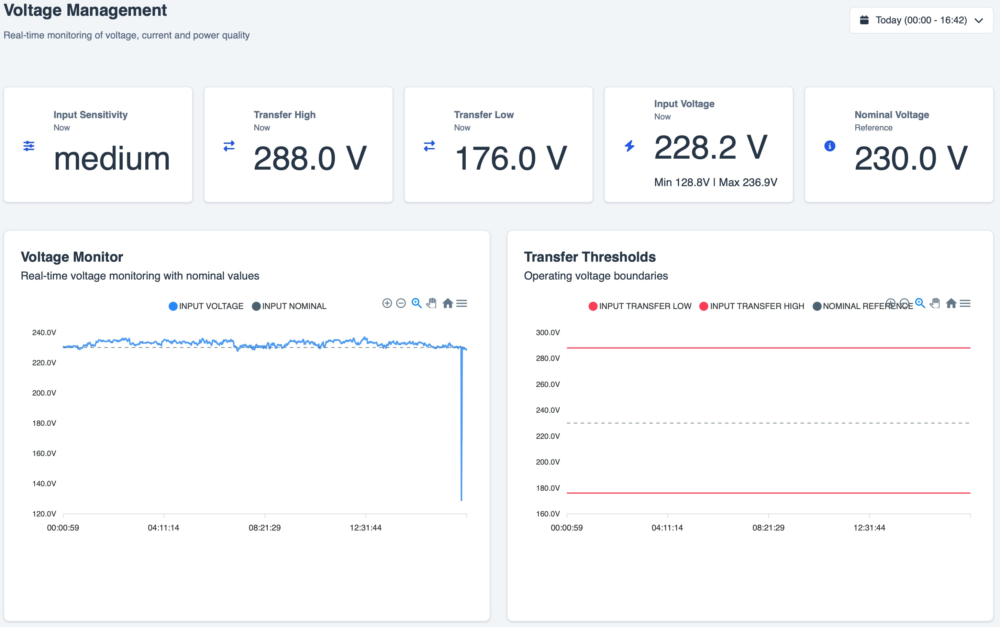
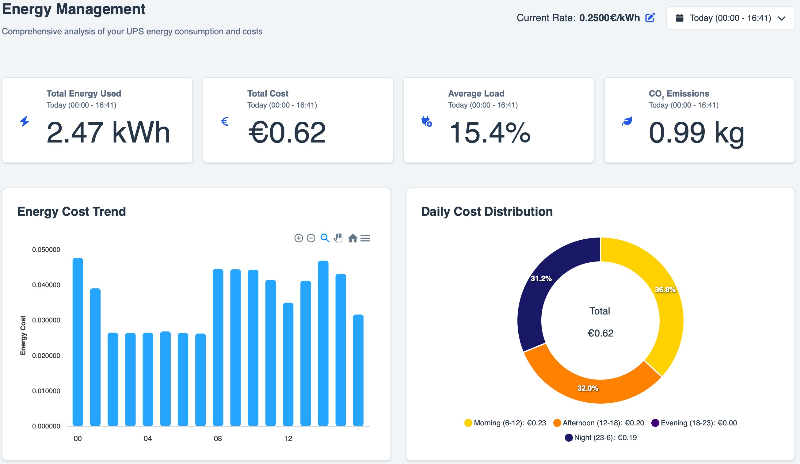
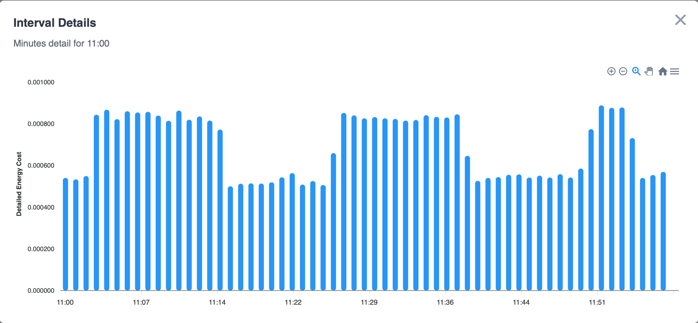

<p align="right">
<a href="https://www.buymeacoffee.com/DartSteven" target="_blank">
  
</a>
</p>

<div align="center">
  
</div>

<p align="center">
  <a href="https://github.com/DartSteven/Nutify/blob/main/changelog.md" target="_blank">
    <!-- NUTIFY_RELEASE_BADGE_START -->
    
    <!-- NUTIFY_RELEASE_BADGE_END -->
  </a>
  <a href="https://github.com/DartSteven/Nutify/wiki" target="_blank">
    
  </a>
  <a href="https://github.com/DartSteven/Nutify/discussions" target="_blank">
    
  </a>
  <a href="https://github.com/DartSteven/Nutify/actions/workflows/ci.yml" target="_blank">
    
  </a>
  <a href="https://github.com/DartSteven/Nutify/releases" target="_blank">
    
  </a>
</p>

<h1 align="center">Nutify - UPS Monitoring System</h1>

Nutify is an open-source UPS monitoring and management platform built on top of <a href="https://networkupstools.org">Network UPS Tools (NUT)</a>. It provides real-time status, historical telemetry, alerts, scheduled reports, and interactive charts through a modern web interface. From single-UPS setups to mixed local/remote multi-UPS fleets, Nutify helps you configure, monitor, and operate your power infrastructure from one place.
Join our <a href="https://discord.gg/ry82VdKK">Discord</a> community for support, testing, and feature discussions. If Nutify helps you, please consider starring the project on GitHub.

<p align="center">
  
</p>

<p align="center">
  
  
  
</p>

<p align="center">
  
  
</p>


## Current Version

<!-- NUTIFY_CURRENT_VERSION_START -->
- Version: `0.3.0` (Public Testing)
<!-- NUTIFY_CURRENT_VERSION_END -->

> [!WARNING]
> This release is **not backward compatible** with previous releases.
>  
> The database must be **recreated from scratch**.
>  
> To avoid incompatible or dirty data, it is strongly recommended to start from a completely clean environment using a **new empty folder**.
> Do not reuse files or data from older versions.

For full details, see [GitHub Releases](https://github.com/DartSteven/Nutify/releases)
and [changelog.md](changelog.md). Each GitHub Release includes deployment files,
checksums, Docker image metadata, and GitHub-generated source ZIP/TAR.GZ archives.

## Supported Architectures

Nutify is available for multiple hardware platforms:

| Architecture | Docker Image Tag | Devices |
|--------------|------------------|---------|
| 🖥️ **AMD64/x86_64** | dartsteven/nutify:latest-amd64 | Standard PCs, servers, most cloud VMs |
| 🍎 **Apple Silicon (ARM64)** | dartsteven/nutify:latest-mac-arm64  | Apple M1/M2/M3+ Macs running Docker |
| 🍓 **Raspberry Pi 3 – 32-bit OS required** | dartsteven/nutify:latest-raspberrypi3-armv7 | For Raspberry Pi 3 running a 32-bit OS |
| 🍓 **Raspberry Pi 4 – 32-bit OS required** | dartsteven/nutify:latest-raspberrypi4-armv7 | For Raspberry Pi 4 running a 32-bit OS |
| 🍓 **Raspberry Pi 4 / 5 – 64-bit OS required** | dartsteven/nutify:latest-raspberrypi5-arm64 | For Raspberry Pi 4 or 5 running a 64-bit OS |

## Quick Start (Docker)

The supplied Compose profile avoids privileged mode, the complete host `/dev`
tree, `SYS_ADMIN`, `SYS_RAWIO`, and `MKNOD`. It exposes only Linux USB device
nodes (major 189) plus read-only udev metadata so the Wizard can discover and
open directly attached USB HID UPS devices. Nutify starts with local
authentication; SSO remains optional.

Create a private `.env` with one persistent runtime secret:

```bash
printf 'SECRET_KEY=%s\n' "$(openssl rand -hex 32)" > .env
```

### Standard Setup

Best for most users. Start with a Nutify username/password. If required later,
configure SSO from **System -> Authentication** without editing Compose.

```yaml
services:
  nut:
    image: dartsteven/nutify:latest-amd64
    container_name: Nutify
    cap_drop:
      - ALL
    cap_add:
      - CHOWN
      - DAC_OVERRIDE
      - FOWNER
      - KILL
      - SETGID
      - SETUID
    security_opt:
      - no-new-privileges:true
    device_cgroup_rules:
      - "c 189:* rwm"
    volumes:
      - ./Nutify/logs:/app/nutify/logs
      - ./Nutify/instance:/app/nutify/instance
      - ./Nutify/ssl:/app/ssl
      - ./Nutify/etc/nut:/etc/nut
      - /dev/bus/usb:/dev/bus/usb:rw
      - /run/udev:/run/udev:ro
    environment:
      SECRET_KEY: ${SECRET_KEY:?Set SECRET_KEY in .env}
      NUTIFY_WEB_USER: nut
      NUT_SERVICE_USER: nut
      UDEV: "1"
      SKIP_PERMCHECK: "true"
      NUTIFY_USB_GID: ${NUTIFY_USB_GID:-}
      SSL_ENABLED: "false"
    ports:
      - "3493:3493"
      - "5050:5050"
      - "443:443"
    restart: always
```

Repository file: [`docker-compose.yaml`](docker-compose.yaml)

```bash
docker compose up -d
```

For automated deployments that require environment-managed OIDC, follow the
[OIDC Environment Configuration guide](https://github.com/DartSteven/Nutify/wiki/OIDC-Environment-Configuration).

Then open:

- `http://localhost:5050`

Serial and non-USB devices may require an explicit Docker mapping. Follow the
[Optional Direct Hardware Access guide](https://github.com/DartSteven/Nutify/wiki/Docker-Compose-Guide#7-optional-direct-hardware-access).

When a reverse proxy cannot preserve `X-Forwarded-Proto` and
`X-Forwarded-Host`, set `SOCKETIO_ALLOWED_ORIGINS` to its exact public
origin. Multiple origins must be comma-separated, for example
`https://nutify.example.com,https://nutify.example.net`. Wildcards are
rejected. Proxies should still forward WebSocket upgrades for realtime data;
the dashboard falls back to authenticated HTTP snapshots while Socket.IO is
unavailable.

The guided SSO flow encrypts the client secret, validates discovery/signing
keys, and requires a real browser login test before activation. The advanced
profile requires HTTPS plus an explicit administrator group and intentionally
keeps `OIDC_ALLOW_ALL_USERS=false`. See the
[OpenID Connect SSO Guide](https://github.com/DartSteven/Nutify/wiki/OpenID-Connect-SSO-Guide)
and [guided setup](https://github.com/DartSteven/Nutify/wiki/OIDC-Guided-Setup).

## Web-Based Configuration

The setup wizard allows you to configure:
- Monitoring profile (`Single Monitor` or `Multi Monitor`)
- Fleet topology based on the selected profile:
  - Single: `Standalone`, `Network Server`, or `Network Client`
  - Multi: `Remote NUT Only`, `Local Targets Only`, or `Mixed Local + Remote`
- Connection method: `Manual Configuration` or `Auto-detect with nut-scanner`
- Driver selection from the supported NUT driver catalog
- Local and remote connection parameters (`host`, `port`, `username`, `password`, `ups identifier`)
- Per-target metadata:
  - `Target Display Name (UI label)`
  - `Target Timezone`
  - `Target Currency`
  - `Polling Interval`
- Validation flow with test actions before save (`Test Target`, `Test & Save Primary Target`)
- Final configuration preview and controlled restart to apply generated NUT files


## Tested UPS Models

Nutify aims for broad compatibility with UPS devices supported by Network UPS Tools (NUT). 

**Is your UPS model working with Nutify but not listed here?** Please help us expand this list by sharing your experience in the

[UPS Compatibility List discussion](https://github.com/DartSteven/Nutify/discussions/category/general)

Knowing which models work helps the entire community.

While Nutify should work with most NUT-compatible devices, the models listed above have specific confirmation from users.

## Documentation [Nutify Wiki](https://github.com/DartSteven/Nutify/wiki)

For detailed documentation, including:
- Complete configuration options
- Advanced features
- Troubleshooting
- Screenshots and examples
- Technical details
- ... And More ...


## 
## 🤖 AI Workflow, Project Philosophy & Governance
 

> *"Is it vibe coding, or is it augmented engineering?"*

I believe writing software today without an AI copilot isn't just slower—it fundamentally changes how we achieve high code quality and speed. However, I want to be 100% transparent about how AI is used in this repository.

### 💡 My Core Concept: AI-Augmented vs. Vibe Coding

This project utilizes AI, but **it is NOT "vibe coding"**. 

* **Vibe Coding (What I DO NOT do):** Blindly prompting an AI to write code from scratch, accepting code without understanding the underlying architecture, or shipping unverified logic.
* **AI-Augmented Engineering (My Workflow):**
  1. **Human Architecture & Core Logic:** I design the entire system, write the core functional codebase, and verify that the logic works as intended.
  2. **Automated AI Review & Refactoring:** I leverage AI agents as an instant, high-speed code reviewer to:
     - 🛡️ **Security Audit:** Spot edge cases, memory leaks, and vulnerabilities.
     - ⚡ **Performance:** Identify performance bottlenecks and optimize execution.
     - 🧹 **Code Hygiene:** Clean up dead code, leftover test functions, and draft snippets in seconds.

This approach turns **5 hours of tedious manual code review into 1 minute of automated optimization**, while maintaining strict human ownership over the architecture.

---

### 🤝 Trust & Community Support

* **To Users & Backers:** If you trust this methodology and appreciate an augmented, high-speed, high-quality development process, your support and trust mean the world to me. If not, thank you for stopping by anyway!

### 🛠️ Contribution Guidelines (For Contributors)

Contributions are very welcome! If you plan to open a Pull Request using AI tools:

1. **Respect the standard:** You are free to use AI tools (GitHub Copilot, Claude, Cursor, ChatGPT, etc.) to assist your work.
2. **Understand what you submit:** You must understand the logic, architecture, and behavior of the code you contribute.
3. **No raw AI dumps:** PRs consisting of raw, unverified AI outputs without personal review or testing will be rejected. 


Every push and pull request validates backend dependencies and Python source,
the React production build, and Compose deployment files. See
[CONTRIBUTING.md](CONTRIBUTING.md) before submitting a change and
[SECURITY.md](SECURITY.md) for private vulnerability reporting.

## License

This project is licensed under the MIT License - see [LICENSE](LICENSE).

<!-- NUTIFY_WHATS_NEW_START -->
## What's New

Read the [current release notes](https://github.com/DartSteven/Nutify/wiki/Release-Notes-0.3.0).
<!-- NUTIFY_WHATS_NEW_END -->

## Support the Project

Nutify is developed and maintained in my free time. If you find this project useful and would like to support its continued development, please consider making a donation.

Your support helps cover development costs and encourages further improvements and new features. Thank you for your generosity!

<p align="center">
  <a href="https://www.blockchain.com/btc/address/bc1qprc948hf49s88cyfhennj5yaafewr8vat9qrk9" target="_blank">
    
  </a>
  &nbsp;&nbsp;
<a href="https://www.buymeacoffee.com/DartSteven" target="_blank">
  
</a>
  </a>
</p>

## Stargazers over time
[](https://starchart.cc/DartSteven/Nutify)
